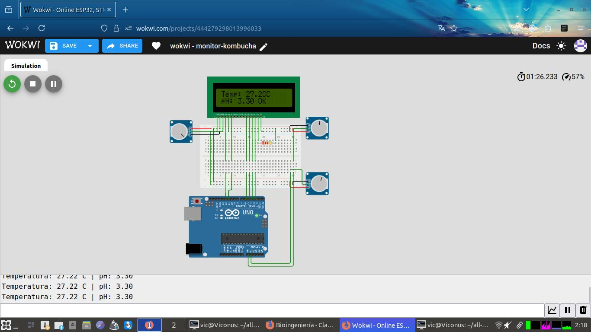

## Simulación

### Ver online
[Proyecto en Wokwi](https://wokwi.com/projects/444279298013996033)

### Ejecutar localmente
Los archivos están en `simulacion/wokwi/`:
1. Ve a https://wokwi.com
2. File > Open Project
3. Selecciona los archivos del directorio
4. Start Simulation

### Capturas

## Simulación

### Ver online
[Proyecto en Wokwi](https://wokwi.com/projects/TU_ID_AQUI)

### Ejecutar localmente
Los archivos están en `simulacion/wokwi/`:
1. Ve a https://wokwi.com
2. File > Open Project
3. Selecciona los archivos del directorio
4. Start Simulation

